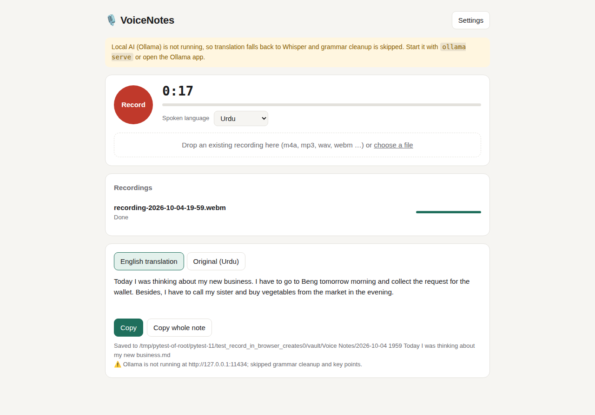

# 🎙️ VoiceNotes

**Speak your thoughts in Urdu or English, then get clean English notes in Obsidian.
Everything runs locally on your Mac, with no subscriptions and no per-use AI credits.**



## What it does

1. **Record:** press *Record* (or Space) and talk for as long as you like. Hour-long sessions are fine. You can also drop in existing recordings (iPhone voice memos, m4a, mp3, wav, …).
2. **Transcribe:** [Whisper](https://github.com/openai/whisper) runs locally on your Mac's GPU and writes down exactly what you said, in Urdu script or English.
3. **Translate:** a local AI model (via [Ollama](https://ollama.com)) translates Urdu into faithful, fluent English. It understands the English words you mix into your Urdu and uses context to fix recognition mistakes.
4. **Refine:** the same local AI fixes grammar, word choice and sentence structure **without dropping details**. It also extracts **key points** and **to-dos**.
5. **Save:** a Markdown note goes into your Obsidian vault. It has action items as checkboxes, key points, the clean text, the English translation, and the original Urdu.

```
🎤 audio ─▶ Whisper (local) ─▶ Urdu/English transcript ─▶ local LLM ─▶ English ─▶ local LLM ─▶ clean text + points + to-dos ─▶ 📝 Obsidian
```

## Quick start (macOS, Apple Silicon)

```bash
git clone https://github.com/Mujtaba-git/clad-voice-notes.git
cd clad-voice-notes
./scripts/install_mac.sh
```

Then open **VoiceNotes** from `~/Applications` or Spotlight. A 🎙️ icon appears in the menu bar and the app opens in your browser.
Open **Settings** and paste the path of your Obsidian vault.

For a step-by-step guide (including the DMG installer and troubleshooting), see **[docs/SETUP.md](docs/SETUP.md)**.

## Command line

```bash
voicenotes serve                       # start the app (http://127.0.0.1:8765)
voicenotes process memo.m4a            # process a file, print the clean text, save the note
voicenotes process memo.m4a --language ur --translator google --no-save
voicenotes doctor                      # check ffmpeg, speech engine, Ollama and model
```

## Documentation

| Document | What's inside |
|---|---|
| [docs/SETUP.md](docs/SETUP.md) | Installing and running on your Mac, choosing models, troubleshooting |
| [docs/ARCHITECTURE.md](docs/ARCHITECTURE.md) | Tech stack, modules, data flow, design decisions, future deployment |
| [docs/RESEARCH.md](docs/RESEARCH.md) | Market and GitHub research, model comparison, why this stack |
| [docs/TESTING.md](docs/TESTING.md) | Test strategy, running the tests, test audio, CI |
| [docs/ROADMAP.md](docs/ROADMAP.md) | What's done, what's next |

## Privacy

With the default settings, nothing leaves your Mac. Audio, transcripts and notes stay on disk.
The *Google Translate* option is off by default; it's the only setting that sends text online.

## License

GPL-3.0. See [LICENSE](LICENSE).
